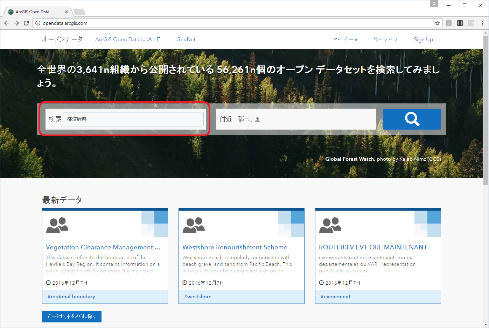

## ArcGIS Open Data データ取得方法
本データカタログサイトでは、マップを見ながら目的のデータセットを検索・プレビューし、必要な範囲の絞り込みを実施したうえで、データセットをダウンロードいただけます。
<http://opendata.arcgis.com/>

####ファイル形式
* スプレッドシート
 * カンマ区切りのテキストファイル形式です。文字コードは UTF-8 です。
* KML
 * OGC (Open Geospatial Consortium, Inc) の規格の1つで、Google Earth などのさまざまなソフトウェアや Web サービスで利用可能な XML 形式のデータフォーマットです。
* シェープファイル　
 * Esri が提唱したベクトル形式の業界標準フォーマットです。ArcGIS はもちろんのこと、そのほかの多くの GIS ソフトウェアで利用が可能です。

####API形式
* GeoJSON
 * GeoJSON は JSON の地理空間拡張です。JSON は Web アプリケーションやスマートフォンのアプリケーションなどで、Web サーバーとのやり取りに広く使用されており、地理空間情報を用いたアプリケーションの開発に利用いただけます。
* ジオサービス（Esri GeoServices REST）
 * ジオサービスは、Esri が提唱した REST 形式の仕様で、クライアントと GIS サーバーとのやり取りに利用されます。仕様が公開されており、ArcGIS 以外のアプリケーションから利用することも可能です。
 
###データ検索方法
本サイトでは、データセットのメタデータに含まれる情報をもとに、データセットを検索することができます。左側の検索ウィンドウから検索します。
<http://opendata.arcgis.com/>

###データセットの絞り込み
データを特定の条件で絞り込むことができます。[データ]タブから絞り込みをかけたいデータのフィールドの▼を選択して条件を入力します。

###データセットのダウンロード
特定の条件で絞り込んだデータのみをダウンロードすることができます。データダウンロードボタンから行います。絞ったデータでダウンロードしたい場合は、[フィルター処理されたデータセット]以下の提供ファイル形式名を選択します。
